## 历时三天，完成了Flutter版本的玩安卓

### 前言

接触Flutter其实已经很久了，从18年下半年就开始关注FLutter了，当时使用Flutter的人还非常少，我也只是大概看了看，写了个小Demo就没再深入了，短短不到两年时间，各大博客社区移动端的文章有一大部分都是关于FLutter的，可以看到，Flutter真的火起来了。

### 正文

关注泓洋大神已经许久，在玩安卓上也学习了很多的知识，看着很多人写了很多版本的玩安卓客户端，有Java的、有Kotlin的、还有Flutter的。其实很早就有自己也写一个玩安卓来练练手的想法，但一直由于时间不够没有付诸实践，这回抽了几天时间，基本完成了常用的功能，比如：文章列表、项目列表、公众号列表、收藏、积分、文章搜索、登录注册等等。

废话不多说，直接来看一下项目的部分截图吧：

| 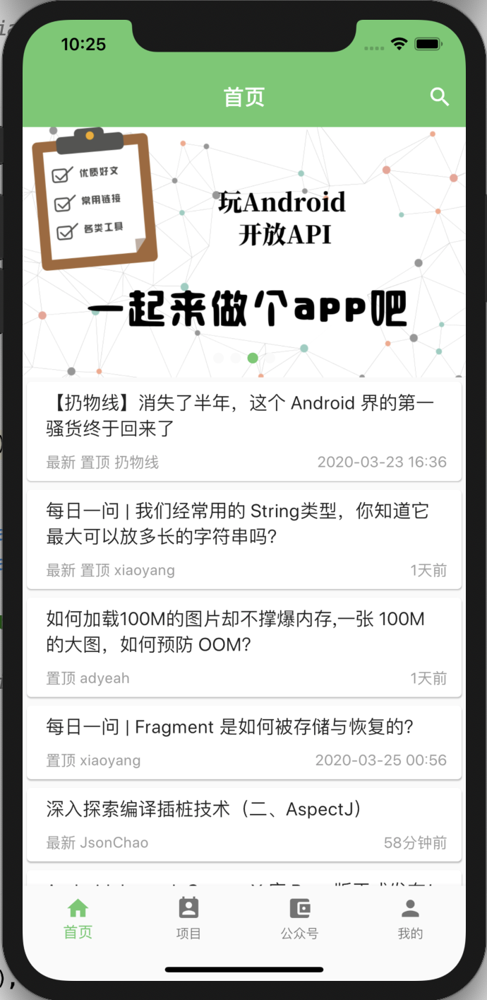 | 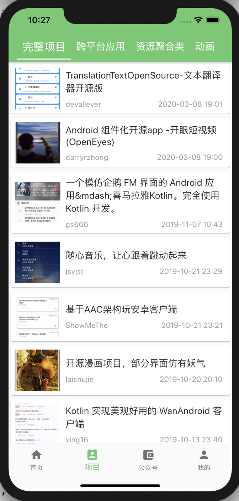 | 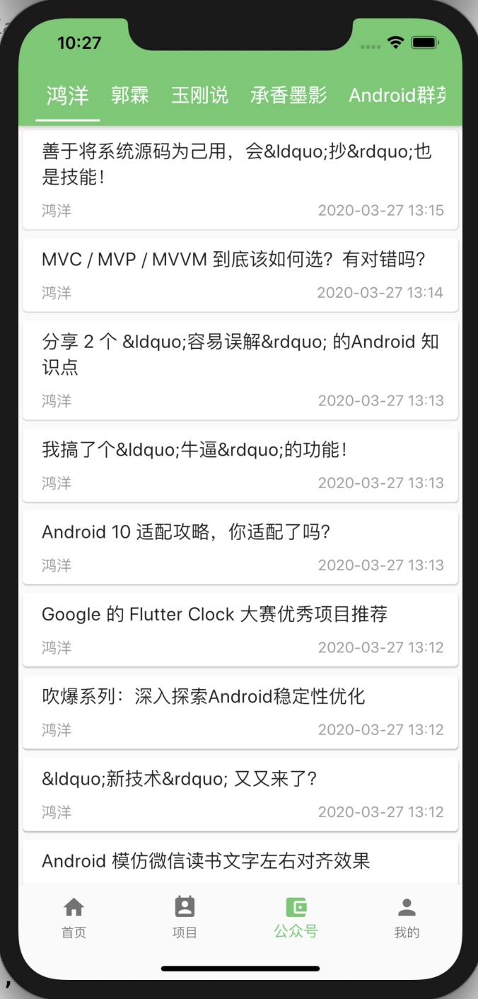 |
| ------------------------------------------------------------ | ------------------------------------------------------------ | ------------------------------------------------------------ |
| 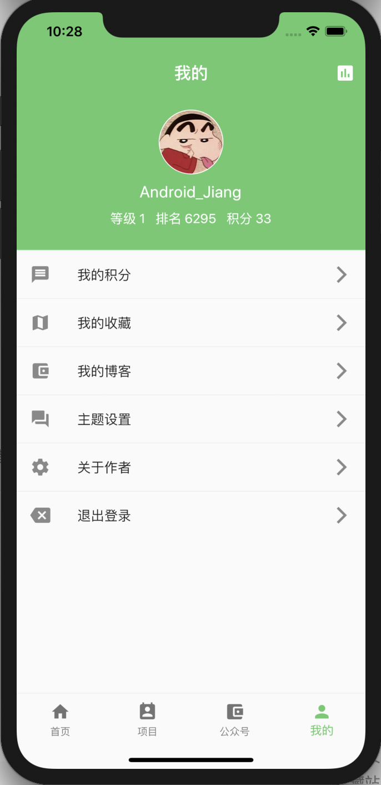 |  | 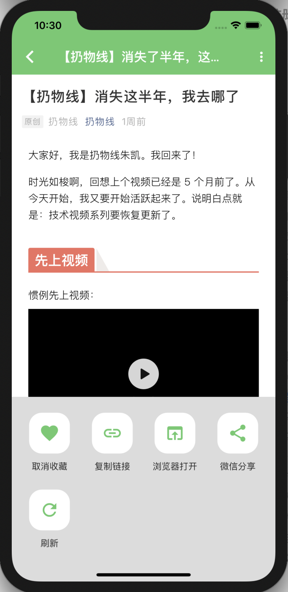 |
| 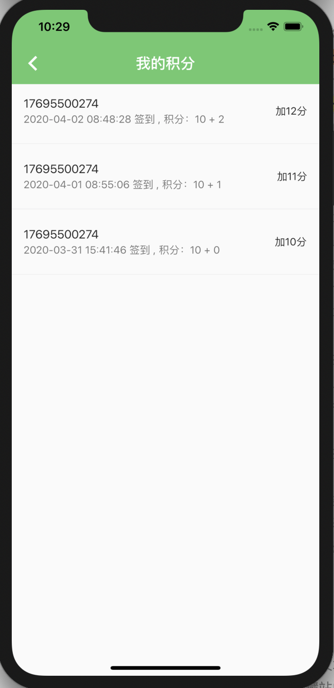 | 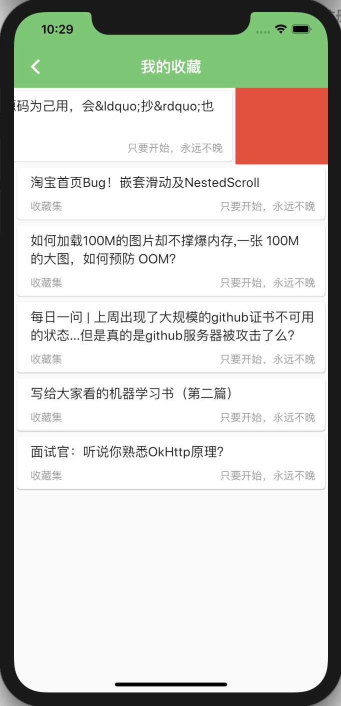 | 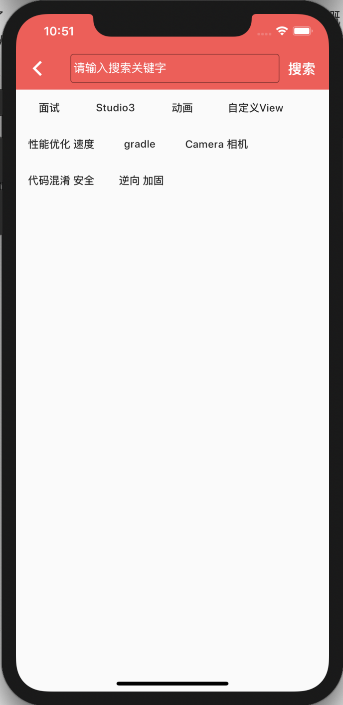 |
| 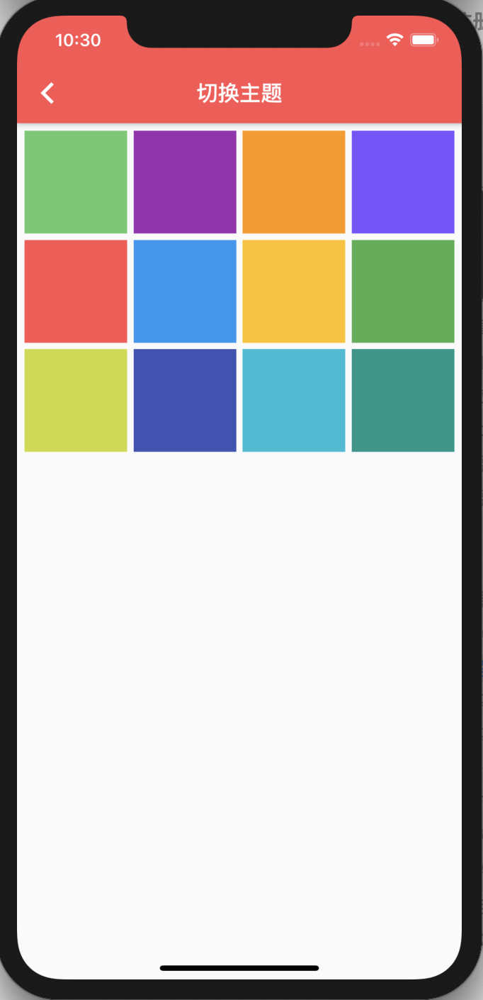 | 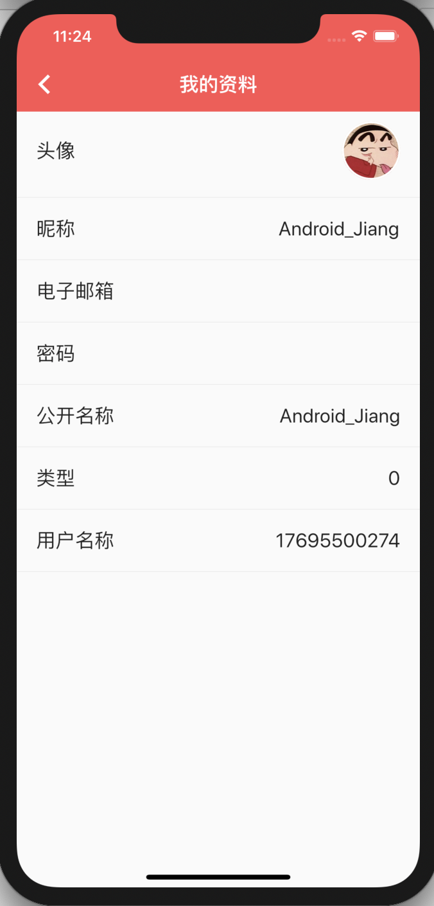 | 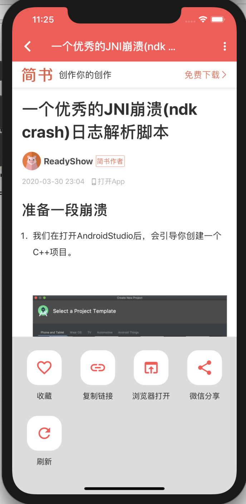 |

### 依赖库

看完了效果图，这里再来放一下用到的依赖库吧：

- **flutter_screenutil**    屏幕适配
- **fluttertoast**    吐司
- **shard_preferences**    类似安卓的sp
- **event_bus**    和安卓的eventbus类似
- **image_picker**    图片选择
- **http**    网络请求
- **flutter_swiper**    轮播图
- **flutter_webview_plugin**    webview插件
- **pull_to_refresh**    下拉刷新、上拉加载

上面的这些库大家可以进https://pub.dev/来进行搜索使用。

### 遇到的问题

三天时间，其实也没有遇到多少问题，说几个比较恶心的问题吧：

- 首先是TabBar和TabView显示公众号的页面，自己想的是直接获取到公众号数据的同时刷新TabController并且直接请求当前公众号的文章列表，这些操作全放在了一块，当时就给我整懵逼了，然后TabView的滑动监听还有问题🤨，后来直接不自己监听了，直接交给TabBar来实现，我需要做的只有新建一个Widget，在里面完成公众号列表的实现，万物皆Widget嘛！
- 后来写完了不需要cookie的接口后（无需登录的接口），在实现需要cookie的接口的时候差点把我弄崩溃，cookie在后台使用较多，但写安卓的时候也没有用过cookie，看泓洋大神写的用PostMan实现也能成功，但是我自己调用的时候给headers传cookie时一直不对，后来想明白了，cookie只是header的一个参数，我把用户名和密码的key学着PostMan都写成了cookie，后台肯定获取不到啊，改了之后就可以了。
- 接下来这个应该属于flutter_webview_plugin插件的一个Bug吧，我在使用WebViewScaffold的时候，死活弹不出底部对话框，但是换成Scaffold的时候就可以弹出来，WebViewScaffold将我们的底部对话框给遮挡住了，所以弹不出来；然后就换了一个思路，直接在WebViewScaffold中的bottomNavigationBar中加上想弹出的页面不得了，然后控制好显示与否就行，具体实现项目中都有，这里不做赘述。

### 总结

Flutter很好用，优点就是开发成本低、速度快、效率高，但缺点也很明显，界面嵌套太多，后期维护很费劲。我也尝试着将安卓中的MVP写到Flutter中，但是效果并不是太好，所以就先放弃了，只能是多抽几个Widget了。大家如果有空也可以自己照着弘扬大神的玩安卓的api写写试试（https://www.wanandroid.com/blog/show/2），如果那块帮助到你了，万分荣幸。

